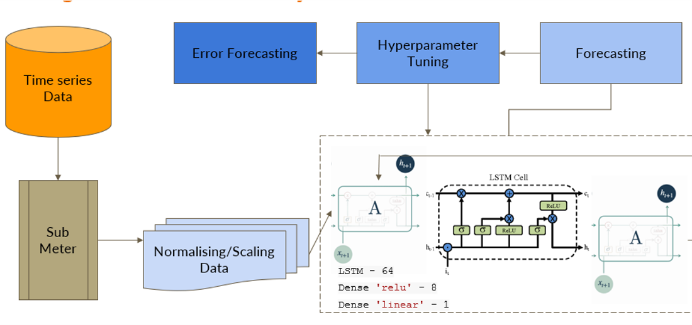

# Network Intrusion Detection System (NIDS)

A ML/DL solution using XAI to detect and classify network intrusions in real-time using packet flow data.

## Table of Contents
1. [Introduction](#introduction)
2. [Features](#features)
3. [Dataset](#dataset)
4. [Model Architecture](#model-architecture)
5. [Technologies Used](#technologies-used)
6. [Setup Instructions](#setup-instructions)
7. [Challenges Faced](#setup-instructions)
8. [Project Workflow](#project-workflow)
9. [Results](#results)
10. [Future Enhancements](#future-enhancements)
11. [LICENSE](#license)
12. [Contributors](#contributors)

---

## Introduction
Network Intrusion Detection Systems (NIDS) are essential for monitoring and identifying malicious activities within a network. This project leverages ML and DL models to classify and predict network traffic in the cyber space.

---

## Features
- **Binary Classification:** Detects whether network traffic is benign or malicious.
- **Multi-Class Classification:** Classifies specific types of attacks.
- **Explainable Decision Tree Classification:** Provides interpretability for multi-class results.
- **Real-Time Detection:** Processes uploaded packet flow data in CSV format.
- **Visualization:** Generates confusion matrices, ROC-AUC curves, and spectrograms for insights.

---

## Dataset
This is the link to the dataset used for this project->[CIC-IDS- 2017](https://www.kaggle.com/datasets/chethuhn/network-intrusion-dataset)

The part of dataset used for our analysis includes network traffic data from:
- **Friday Working Hours:** Afternoon DDoS traffic.
- **Thursday Working Hours:** Morning Web Attacks.
  

### Class Labels
1. Benign
2. PortScan (Attack)
3. Web Attacks (Brute Force, XSS, SQL Injection)

---

## Model Architecture
### Machine Learning Models:
- Logistic Regression
- Random Forest
- K-Nearest Neighbors (KNN)
- Support Vector Machine (SVM)
- Naive Bayes
- Gradient Boosting

### Deep Learning Models:
- 1D CNN
- LSTM
- ANN

### Architecture Diagram


---

## Technologies Used
- **Programming Languages:** Python
- **Frameworks:** TensorFlow, Keras, Scikit-learn
- **Libraries:** Matplotlib, Seaborn, Librosa, Joblib
- **Deployment Platform:** Streamlit
- **Cloud Services:** AWS S3 for data and model storage, Sagemaker for model deployment

---

## Setup Instructions
1. **Clone the repository:**
   ```bash
   git clone https://github.com/veydantkatyal/network-intrusion-detection-system-nus.git
   cd network-intrusion-detection-system-nus
   
2. Add Pre-trained Models and Dataset
- **Place .pkl files for ML models** in the `models/` directory.
- **Place .h5 files for DL models** in the `models/` directory.
- **Place CSV files** in the `data/` directory.

3. Start the Streamlit App
Run the following command to start the Streamlit app:
    ```bash
    streamlit run app.py

---

## Challenges Faced
1. **Handling Imbalanced Dataset**  
   - Initial datasets had a significant imbalance between benign and attack samples.
   - Applied stratified sampling and downsampling techniques to achieve balanced classes.
   
2. **Cleaning Large Datasets**  
   - The datasets contained duplicates, null values, and infinite values.
   - Ensured robust data preprocessing to handle these issues efficiently.

3. **Feature Selection**  
   - Identifying relevant features from a large number of columns was complex.
   - Used correlation analysis and feature importance techniques to select key features.

4. **Training Deep Learning Models**  
   - Adjusting hyperparameters for optimal model performance required extensive experimentation.
   - Computational resource constraints made training large models challenging.

5. **Model Deployment**  
   - Integrating both ML and DL models into a unified Streamlit app required careful design.
   - Ensured smooth handling of multiple classification types (binary, multi-class, decision tree).

6. **Explaining Model Predictions**  
   - Providing feature-level interpretability for the decision tree was time-consuming but essential for actionable insights.

---

## Project Workflow

## 1. **Data Cleaning & Preprocessing**
- Removed duplicates, null values, and infinite values.
- Scaled features using `StandardScaler`.
- Encoded labels for binary and multi-class classification.

## 2. **Feature Engineering**
- Performed correlation analysis for feature selection.
- Applied stratified sampling for balanced class distribution.

## 3. **Model Training**
- Trained ML models using stratified 80-20 train-test splits.
- Trained DL models using reshaped datasets with hyperparameter tuning.

## 4. **Evaluation**
- Evaluated models using:
  - **Accuracy**
  - **Confusion Matrix**
  - **Classification Report**
  - **ROC-AUC Curves**

## 5. **Deployment**
- Integrated models into a **Streamlit app** with:
  - Model selection options.
  - Real-time detection capabilities.

---

# Results

### **Binary Classification**
- **Best ML Model:** Random Forest-96.7%
- **Best DL Model:** LSTM-98.52%

### **Multi-Class Classification**
- **Best ML Model:** Random Forest-97.56%
- **Best DL Model:** LSTM-92.26%

### **Explainable Decision Tree**
- **Best ML Model:** Random Forest-98.78%
- **Best DL Model:** LSTM-97.18%
- **Key Insights:** Provides feature-level interpretability.

---

## Future Enhancements
- Integration with live network traffic for real-time monitoring.
- Expanding multi-class capabilities with more granular attack types.
- Scale the system for large-scale deployment using AWS and commercialize it

---

## License
This project is licensed under->[MIT License](https://github.com/veydantkatyal/network-intrusion-detection-system-nus/blob/main/LICENSE), please check it out before using this resource.

---

## Contributors
- **[Veydant Katyal](https://github.com/veydantkatyal)**  
- **[Spurthi Bhat](https://github.com/spurthibhat13)**  
- **[Shreya Sethu](https://github.com/shreyasethu)**  
- **[Aarav Patel](https://github.com/aaravpatel0409)**
- **Vishal RS**
- **Noorul Hassan**  
